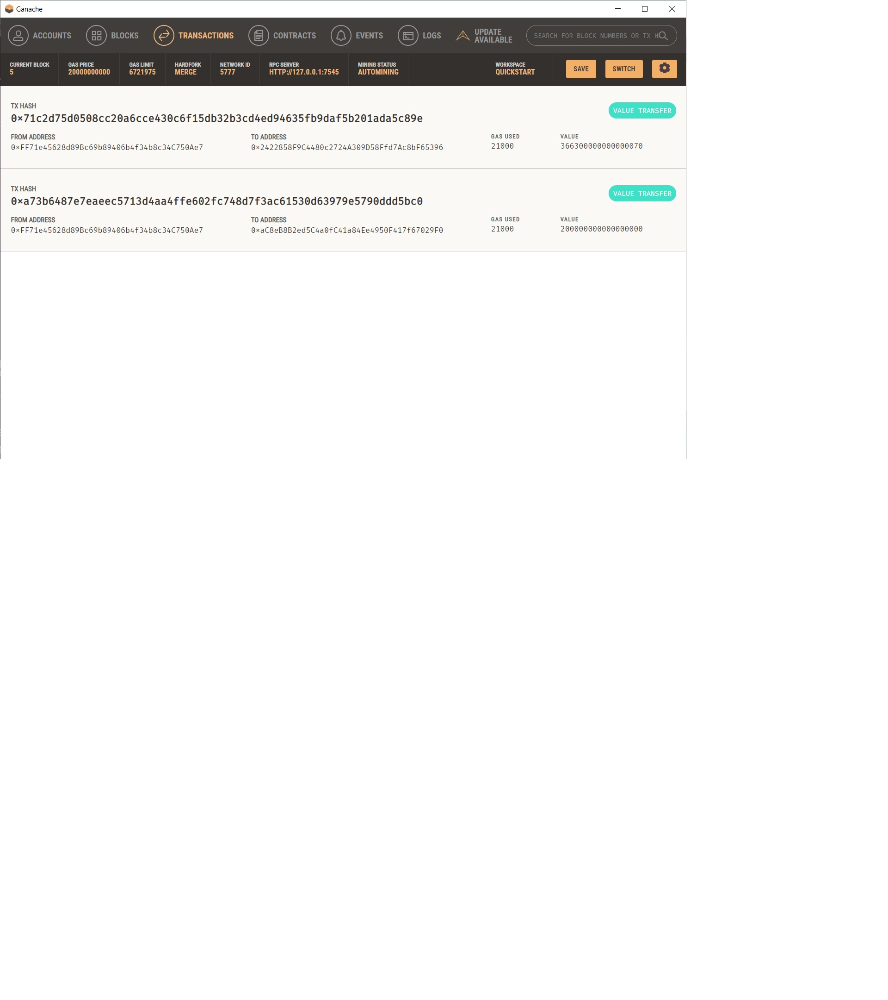
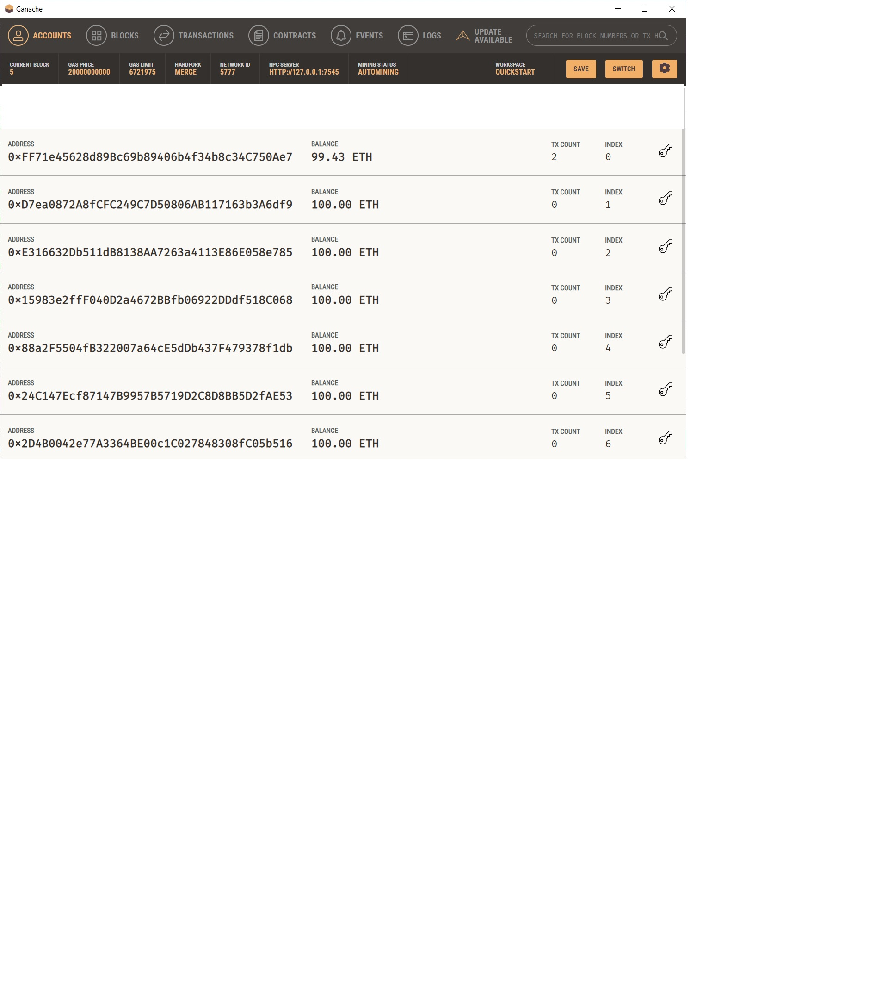

# Module_19_Crypto_Transxns

### The purpose of this application is to allow users to hire and pay fintech professionals using a Streamlit app interface. The app connects crypto (eth) wallets and allows transactions to occur within a localized blockchain. 

---
## To run this application, in terminal run: streamlit run fintech_finder.py. Then select a fintech pro and input the number of hours worked. The candidate's hourly rate and total wage will appear on the sidebar. Lastly, click 'Send Transaction.' At this point a validated transaction hash will appear in the sidebar to confirm the transaction.

## Example Eth funds transfer to hired fintech pro: 

---
## Example transaction Ganache and adding block to local blockchain:

---
## Example account balance Ganache:

---
## MIT License
